These are the accuracy metrics the for uniform train/test model, which is what I'm using to make predictions for *deepflora*.

## Species support

The distribution of support across species. Columns of panels in the figure separate data by the two states, and rows of panel show either just bee floral resource species ("floralres") or the full species list ("full").

```{r}
#| fig-cap: Distribution of species support (number of observations)
#| warning: false
#| message: false

library(tidyverse)
source("R/plot_standards.R")

plot_persp <- read.csv("data/results/per-sp-accuracy.csv") %>%
  pivot_wider(names_from = metric, values_from = value) %>% 
  filter(model=="db", band == "band-1")

ggplot(plot_persp, 
       aes(support, fill = state)) + 
  geom_histogram(bins=20, position="identity") + 
  facet_grid(subset~state, scales = "free_y",
             labeller = as_labeller(c(subset_labels, state_labels))) +
  egg::theme_article() +
  labs(y="Number of species")

```

## Metrics summaries

Below are the accuracy metrics reported by deepbiosphere along with explanations from the supplement of Gillespie et al. 2024. In the plots below I am showing the distributions of per-species metrics for the full species list and for bee floral resources. Significance comparisons are made between deepbiosphere and four other modeling approaches available in the deepbiosphere repository: BioclimMLP, a multilayer perceptron trained only on the Bioclim data; TResNet, a deep neural net model trained only on the NAIP imagery; Maxent, a maximum entropy modeling approach trained on bioclimatic data; and a random forest model trained on bioclimatic data.

## Binary classification metrics

These metrics threshold all probabilities ≥0.5 as present and \<0.5 as absent for these metrics

### Presence accuracy

The fraction of examples where the correct species observed at a location was predicted as present. This is "zero-one accuracy" in the deepbiosphere code.

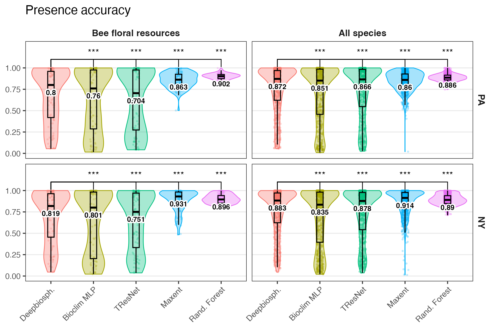

### Precision score

**Precision** Measures how many species predicted to be present were actually present.

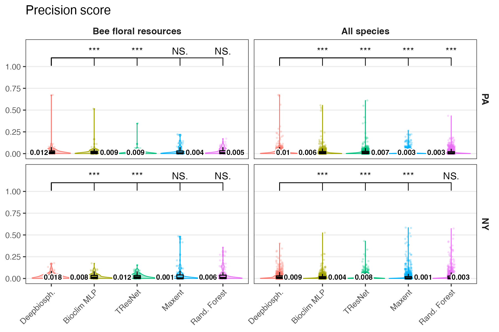

### Recall score

**Recall** Measures how many of the true species present are predicted as present.

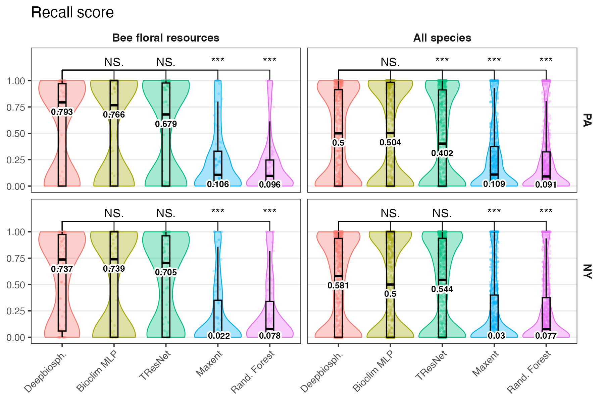

### F1 score

**F1 score** The harmonic mean of precision and recall and represents a conservative mean of the two (i.e. is more affected by low values).

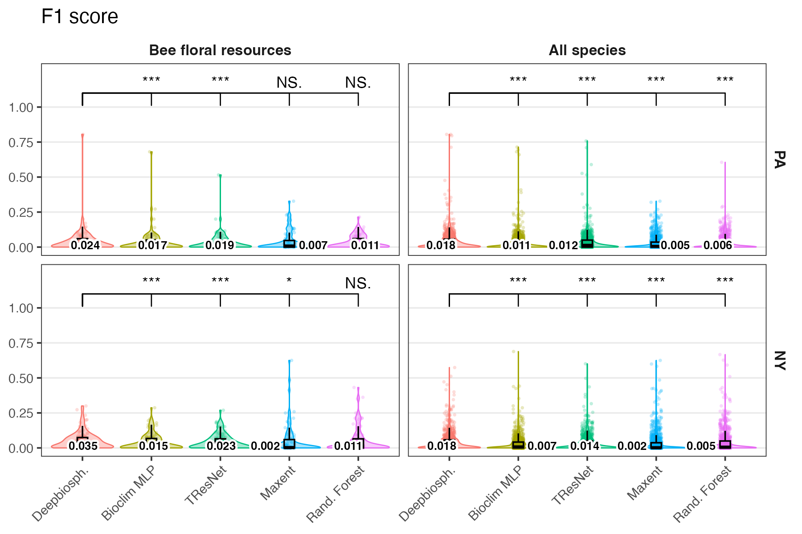

## Discrimination metrics

In order to take into account the effect of thresholds, discrimination metrics measure binary classification ability across a wide range of thresholds in order to calculate an SDM’s performance across a wide range of presence thresholds and describe the relationship between threshold change and performance change.

### Area under curve \[ROC\] -- uncalibrated

**AUC ROC** Area under the receiver operating characteristic curve averaged across species

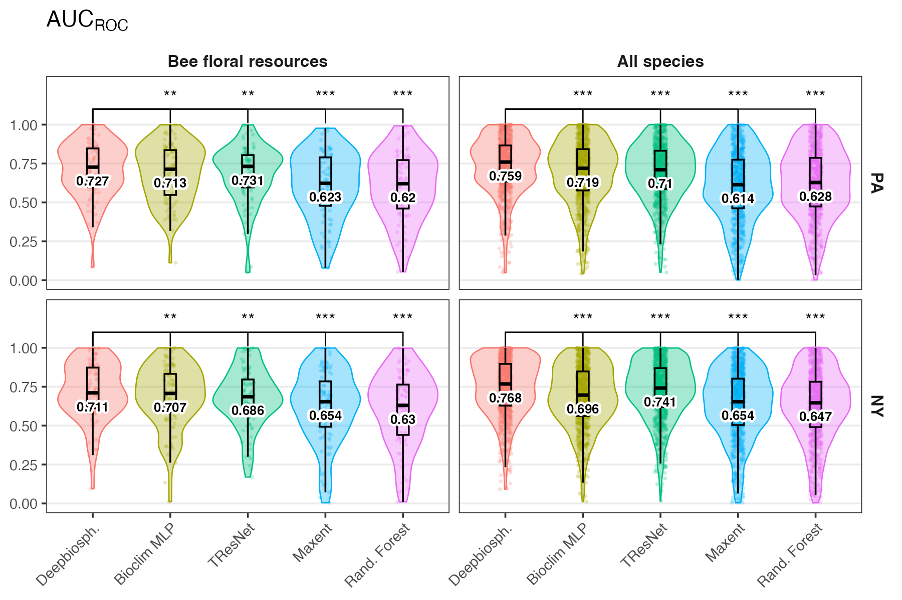

### Area under curve \[PRC\] -- uncalibrated

**AUC PRC** Average area under the precision-recall curve averaged across species

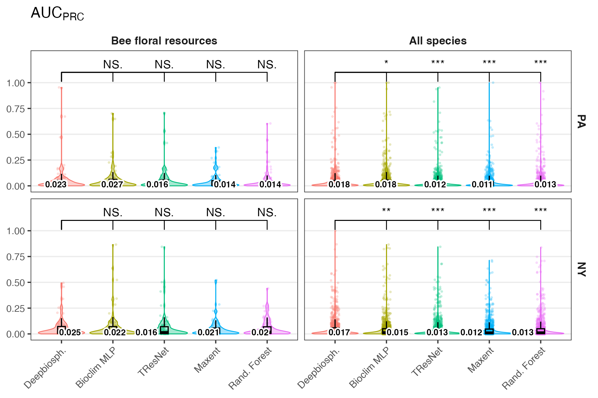

### Calibrated area under curves

A model which has extremely low predicted probabilities can still nevertheless have a high AUCROC if within its range of predicted probabilities said model has good sensitivity and specificity for that class.

- This means that it’s possible to have a model that never predicts a species as present with the standard presence/absence threshold of 0.5 yet still has a high average AUCROC.

- To correct for this, we also introduce a calibrated area under the curve score where the chosen thresholds are linearly interpolated values between 0 and 1.

#### Calibrated AUC \[ROC\]

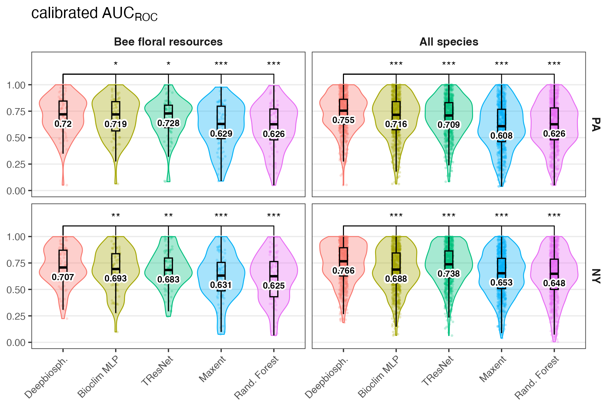

#### Calibrated AUC \[PRC\]

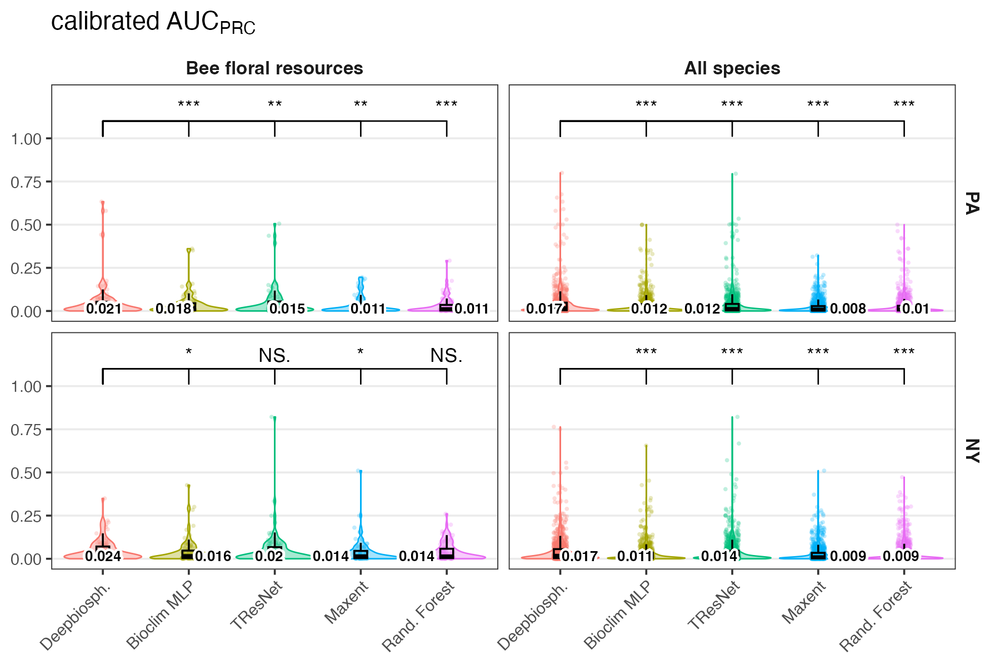

## Ranking metrics

**Top-K (top 1, 5, 30, 100)** These metrics measure how many times the correct species was correctly predicted within the top-K highest-ranked species within a given image (where, for example, K=5 would be the 5 species with the highest probability of presence).

### Species top 1

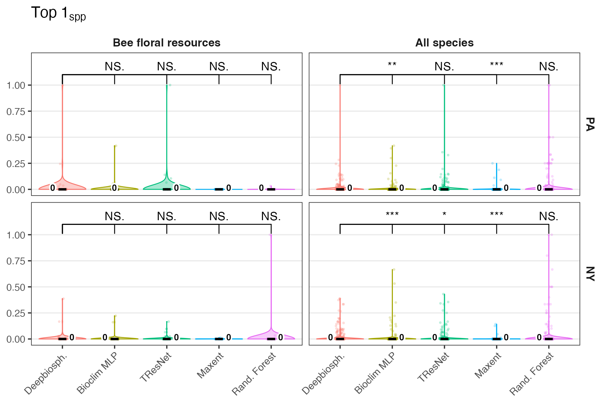

### Species top 5

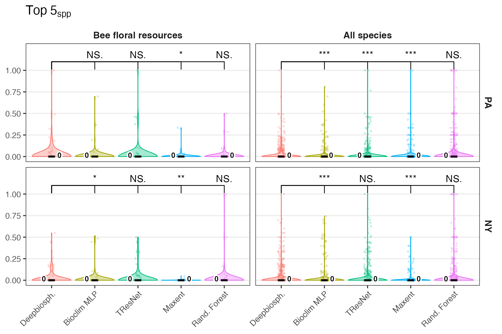

### Species top 30

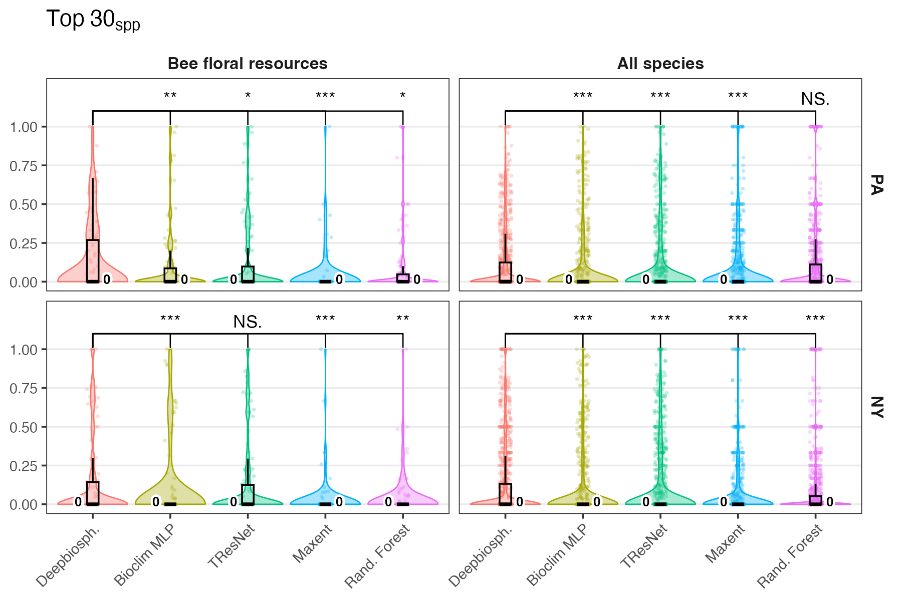

### Species top 100

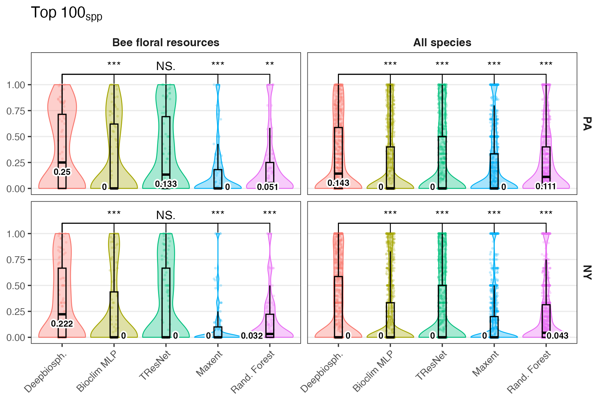
