Explanation text based on supplemental material of Gillespie et al. 2024.

## Binary classification metrics

Threshold all probabilities ≥0.5 as present and \<0.5 as absent for these metrics

### Presence accuracy

(Zero one accuracy?) The fraction of examples where the correct species observed at that location was predicted as present

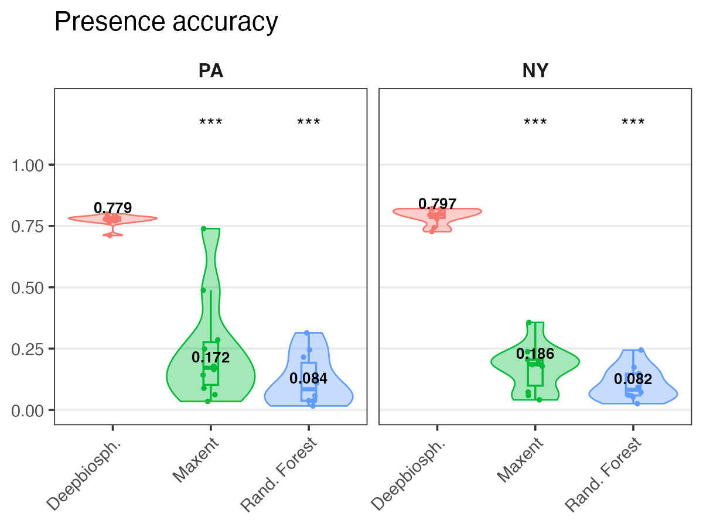

### Precision score

**Precision** Measures how many species predicted to be present were actually present.

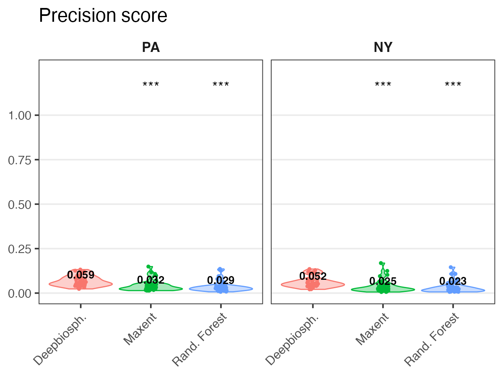

### Recall score

**Recall** Measures how many of the true species present are predicted as present.

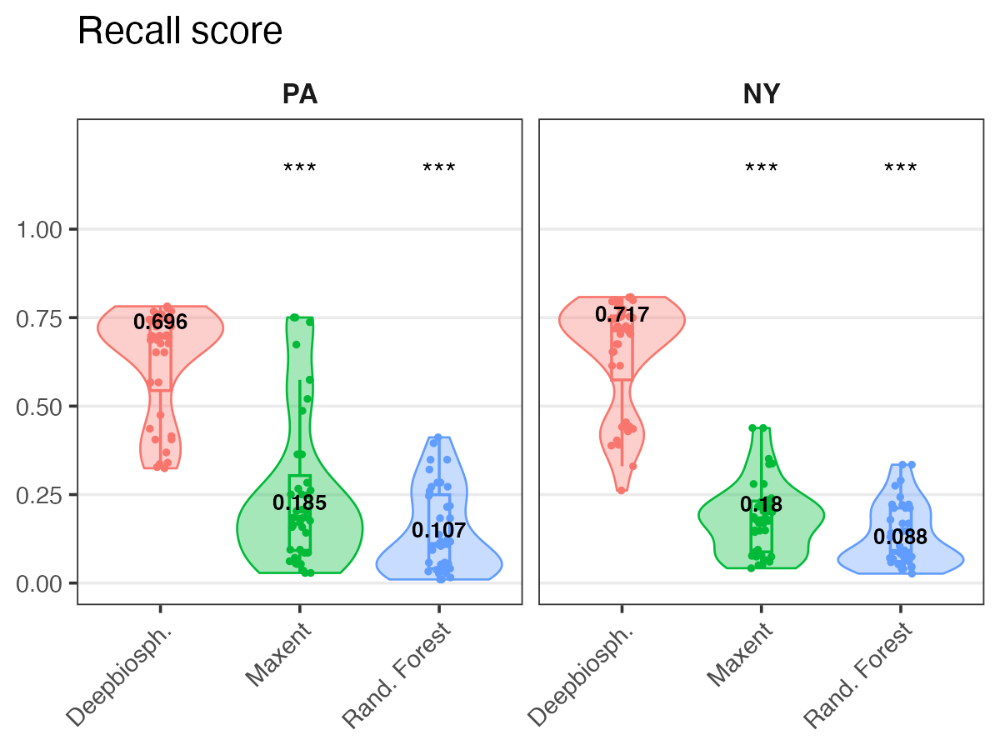

### F1 score

**F1 score** The harmonic mean of precision and recall and represents a conservative mean of the two (i.e. is more affected by low values).

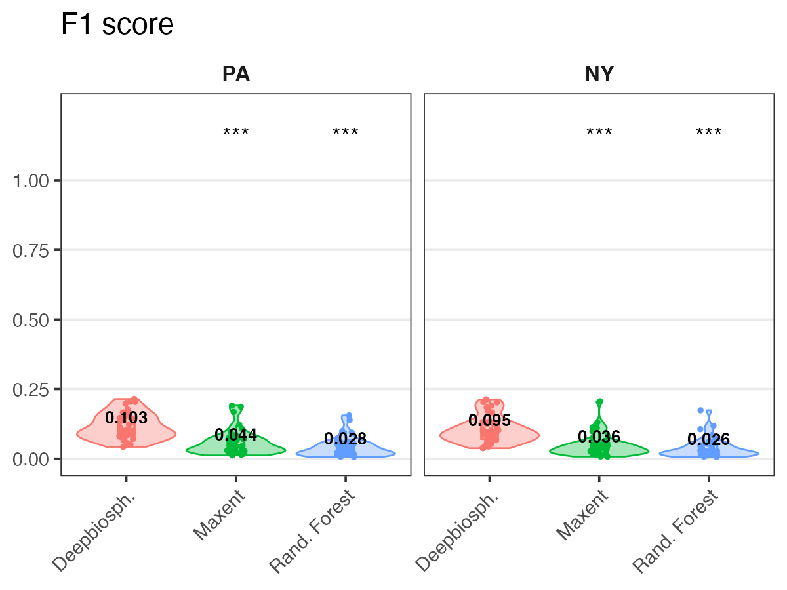

## Discrimination metrics

In order to take into account the effect of thresholds, discrimination metrics measure binary classification ability across a wide range of thresholds in order to calculate an SDM’s performance across a wide range of presence thresholds and describe the relationship between threshold change and performance change.

### Area under curve \[ROC\] -- uncalibrated

**AUC ROC** Area under the receiver operating characteristic curve averaged across species

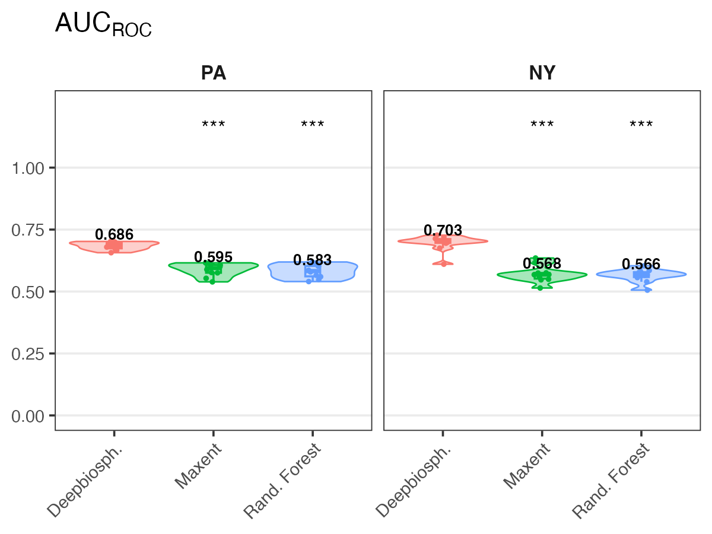

### Area under curve \[PRC\] -- uncalibrated

**AUC PRC** Average area under the precision-recall curve averaged across species

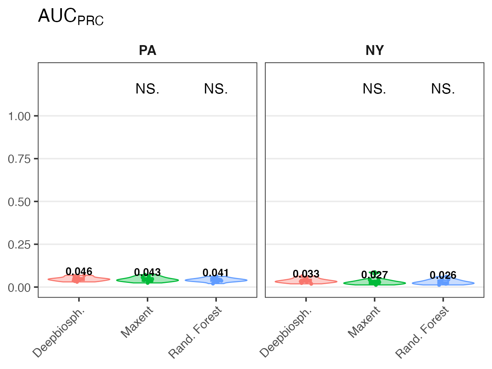

### Calibrated area under curves

A model which has extremely low predicted probabilities can still nevertheless have a high AUCROC if within its range of predicted probabilities said model has good sensitivity and specificity for that class.

- This means that it’s possible to have a model that never predicts a species as present with the standard presence/absence threshold of 0.5 yet still has a high average AUCROC.

- To correct for this, we also introduce a calibrated area under the curve score where the chosen thresholds are linearly interpolated values between 0 and 1.

#### Calibrated AUC \[ROC\]

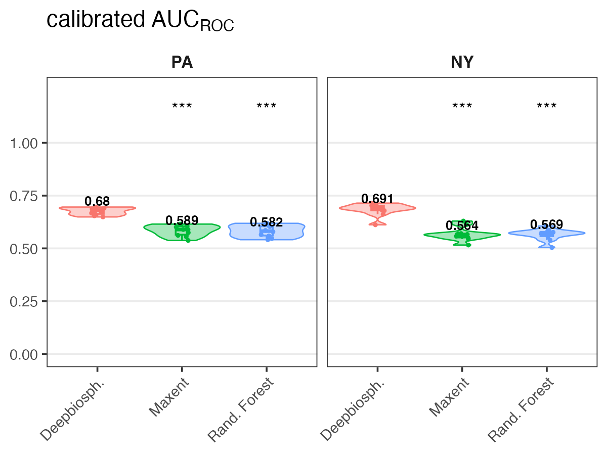

#### Calibrated AUC \[PRC\]

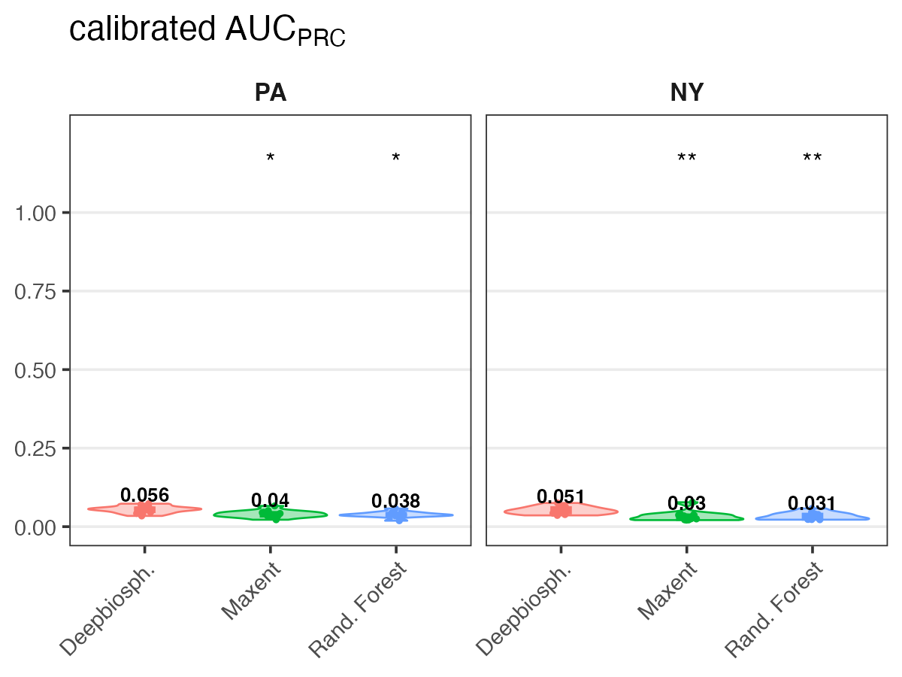

## Ranking metrics

**Top-K (top 1, 5, 30, 100)** These metrics measure how many times the correct species was correctly predicted within the top-K highest-ranked species within a given image (where, for example, K=5 would be the 5 species with the highest probability of presence).

### Species top 1

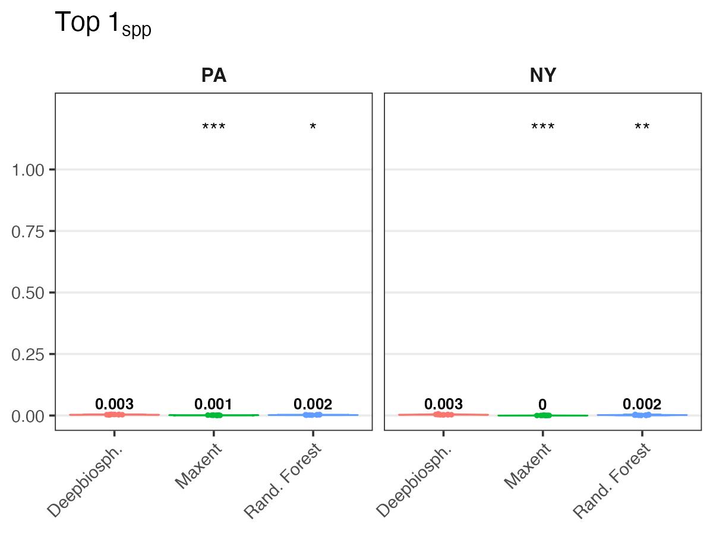

### Species top 5

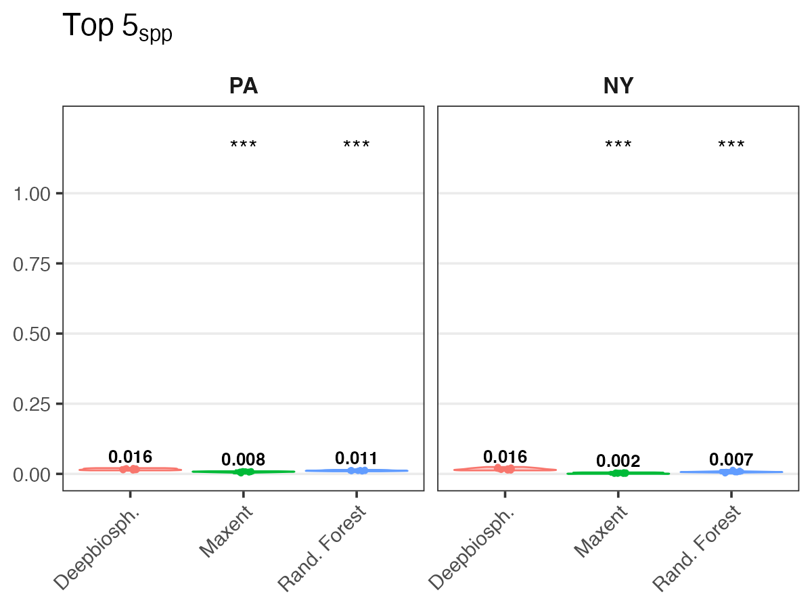

### Species top 30

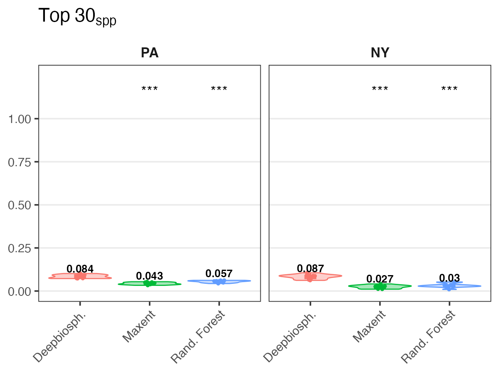

### Species top 100

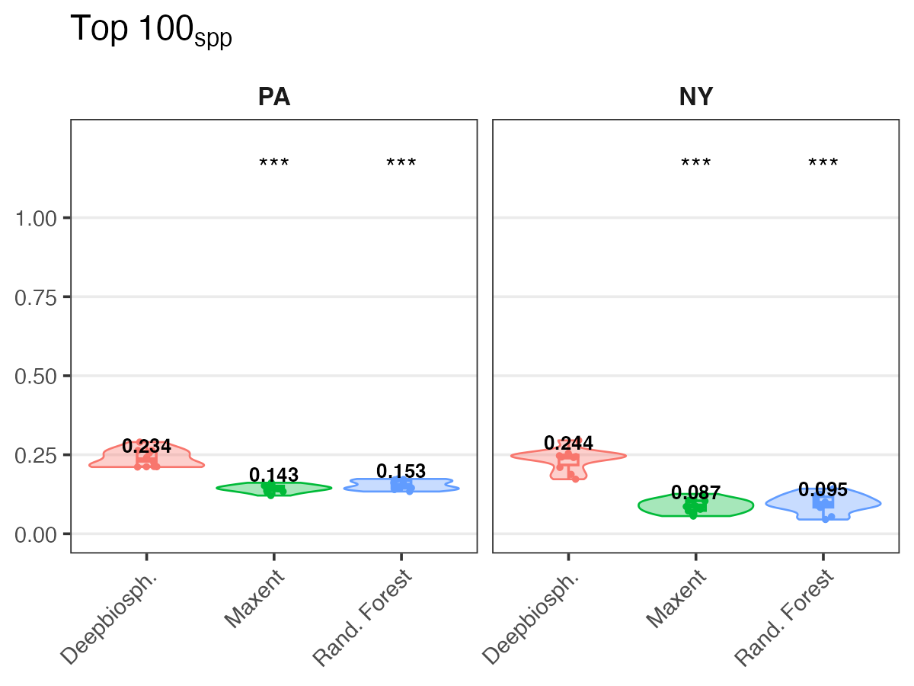
