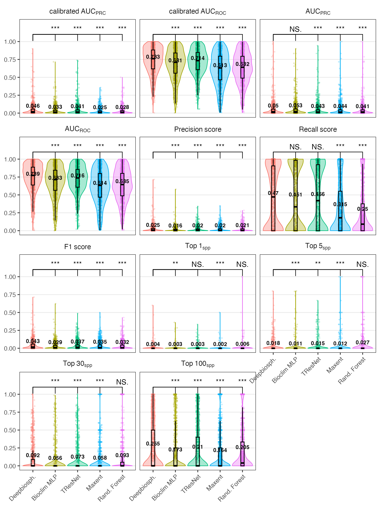
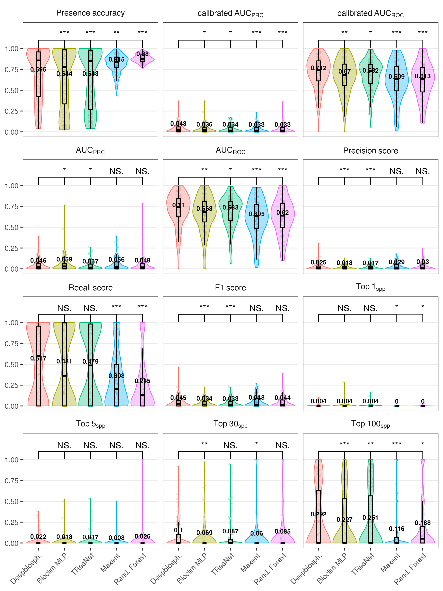
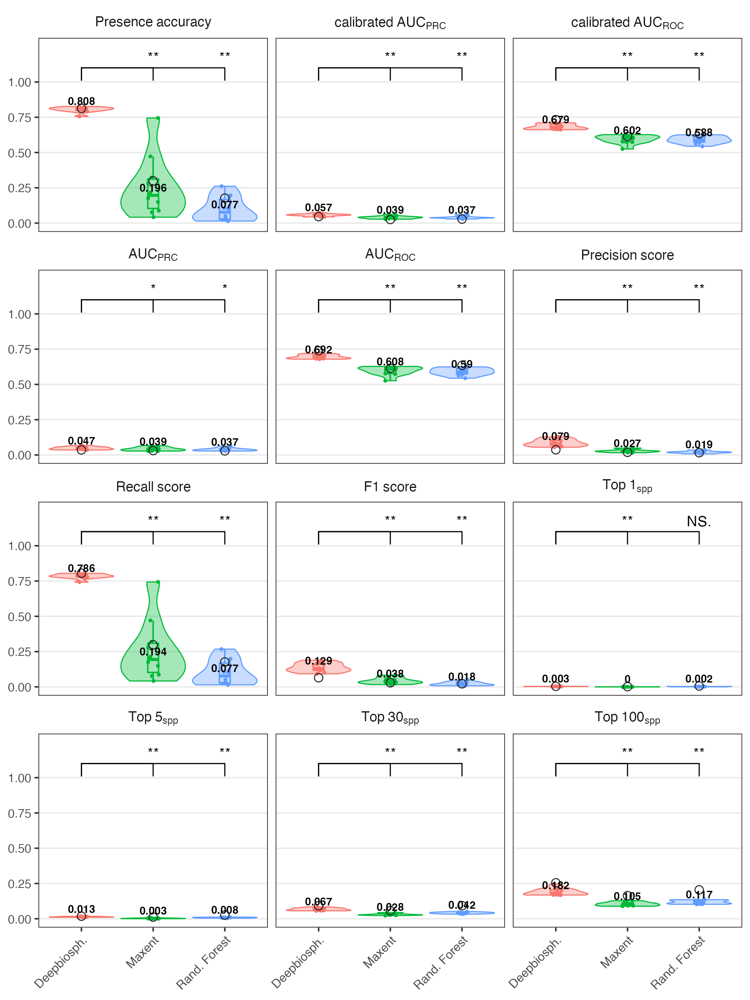

```{r}
#| message: false
#| results: false

library(tidyverse)
library(DT)
library(rstatix)
library(ggsignif)
```

## Uniform train-test split results

### Full dataset



### Floral resources only



## Spatial cross validation results (full dataset)




## List of floral resource species

```{r}
plot_persp <- read.csv("data/results/per-sp-accuracy.csv")

floralsp <- plot_persp %>% ungroup() %>%
  pivot_wider(names_from = metric, values_from = value) %>%
  filter(subset == "floralres" & model == "initial") %>%
  dplyr::select(-model, -subset, zero_one_accuracy) %>%
  relocate(support, .before = species_top1) %>%
  distinct() %>% arrange(genus, sp)

```

```{r}

DT::datatable(floralsp %>% mutate(across(species_top1:zero_one_accuracy, \(x) round(x, 2))))
```

### Species support

```{r}
#| fig-cap: Distribution of species support (number of observations)

ggplot(floralsp, aes(support)) + geom_histogram(bins=20,fill="sienna") + egg::theme_article()

```

```{r}

# rank
# persp_rank <- plot_persp %>%
#   pivot_wider(names_from = metric, values_from = value) %>%
#   pivot_longer(cols = species_top1:zero_one_accuracy, names_to = "metric") %>%
#   group_by(subset, model, metric) %>%
#   mutate(rank = rank(desc(support), ties = "first"))

# ggplot(persp_rank %>% filter(subset=="full"), aes(rank, value)) + 
#   geom_point() + 
#   facet_grid(metric~model)

```


## Accuracy metrics definitions

Text from supplemental material of Gillespie et al. 2024.

### Binary classification metrics

Threshold all probabilities ≥0.5 as present and <0.5 as absent for these metrics

**Presence accuracy** (Zero one accuracy?) The fraction of examples where the correct species observed at that location was predicted as present

**Precision** Measures how many species predicted to be present were actually present.

**Recall** Measures how many of the true species present are predicted as present.

**F1 score** The harmonic mean of precision and recall and represents a conservative mean of the two (i.e. is more affected by low values).

### Discrimination metrics

In order to take into account the effect of thresholds, discrimination metrics measure binary classification ability across a wide range of thresholds in order to calculate an SDM’s performance across a wide range of presence thresholds and describe the relationship between threshold change and performance change.

**AUC ROC** Area under the receiver operating characteristic curve averaged across species

**AUC PRC** Average area under the precision-recall curve averaged across species

**Calibrated AUC** A model which has extremely low predicted probabilities can still nevertheless have a high AUCROC if within its range of predicted probabilities said model has good sensitivity and specificity for that class.
 
 - This means that it’s possible to have a model that never predicts a species as present with the standard presence/absence threshold of 0.5 yet still has a high average AUCROC.
 
 - To correct for this, we also introduce a calibrated area under the curve score where the chosen thresholds are linearly interpolated values between 0 and 1.

### Ranking metrics

**Top-K (top 1, 5, 30, 100)** These metrics measure how many times the correct species was correctly predicted within the top-K highest-ranked species within a given image (where, for example, K=5 would be the 5 species with the highest probability of presence).
