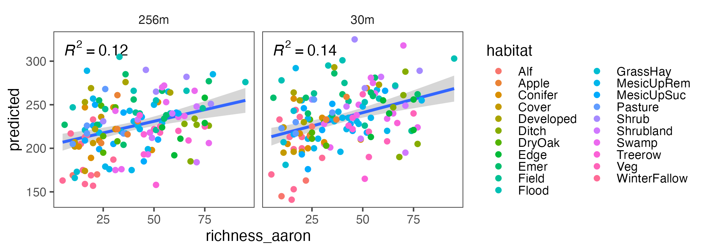
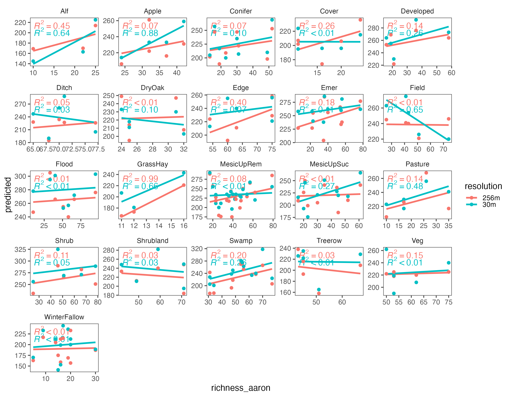
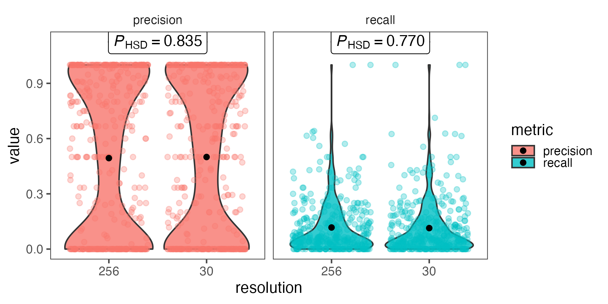
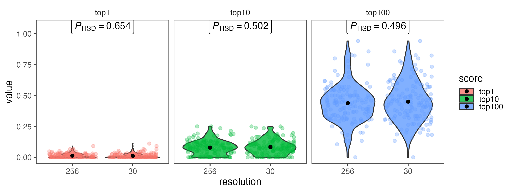
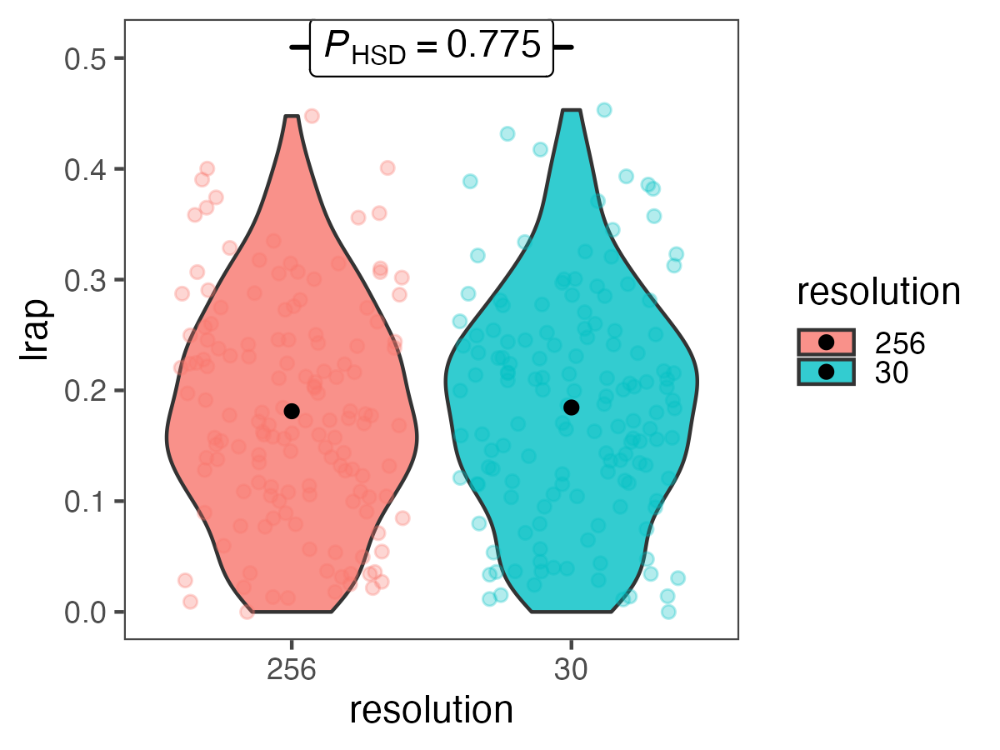
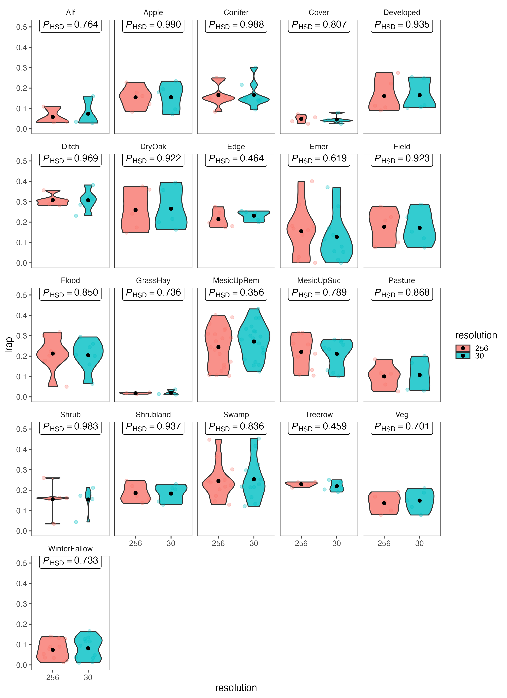

## Aaron's data

**Updated Sept. 16 2026 with 30m resolution results**

I compared the predictions within 256 m and 30m resolution cells of the statewide NY Deepbiosphere projection to Aaron's species list collected at 144 sites using the modified Whitaker species richness sampling method.

### Estimated species richness

When I compare the predicted species richness per plot, there is a slight improvement in correlation between Aaron's data and the predicted, when I use 30m resolution DeepBiosphere data.

#### Comparison of estimated species richness by habitat group

If I look at the correlation by habitat type, there are some habitats that improve with 30m resolution, but others get worse.

### Accuracy metrics

Comparing Deepbiosphere predictions against Aaron's detected presences as 'truth.' These metrics are calculated across only the species detected in both Aaron's and Deepbiopshere's species lists (452 species).

#### Precision and recall

Using higher resolution prediction doesn't significantly improve precision or recall metrics (t-test results).

#### Top 1, 10, and 100 scores

The proportion of times across the 144 sites that a predicted species was in the top 1, 10, or 100 most probable classes estimated by DeepBiosphere also don't improve significantly (t-test results).

#### Label Ranking Average Precision (LRAP)

The "top-N" scores are actually designed for assessing single label tasks, but DeepBiosphere is a multi-label model. The LRAP score takes into account the ability of the model to predict multiple species together, as well as the species rank in the prediction. In other words, are the actually present species highly ranked by the model, and are these species ranked higher in the model than non-present species.

An LRAP score closer to 1 is better. When LRAP = 1, all of the top model-predicted species were found in the actual site.

Here's the distribution across sites, with a comparison between resolutions (p-values for t-test).

And here I'm splitting the scores by habitat (p-value for t-test)

