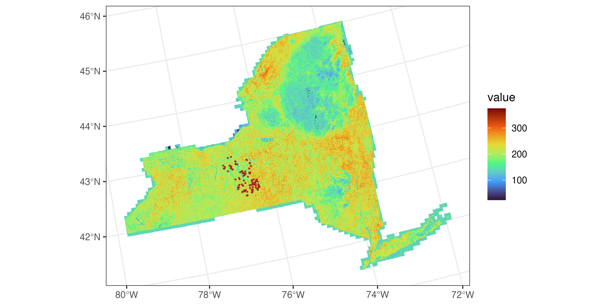
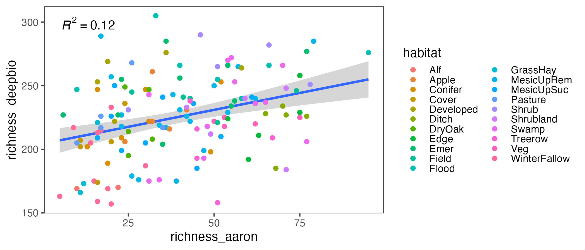
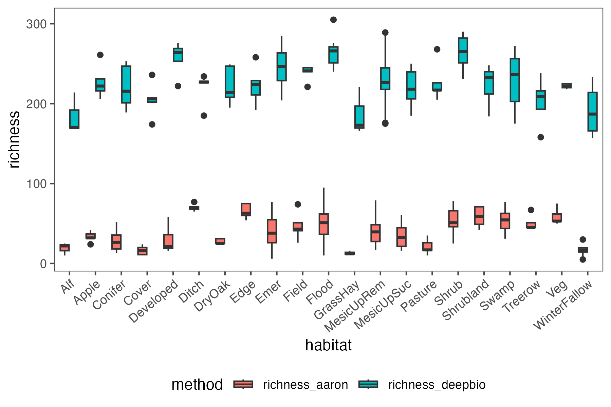
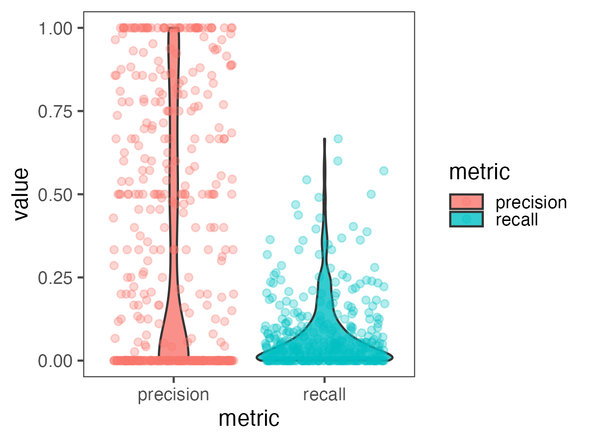
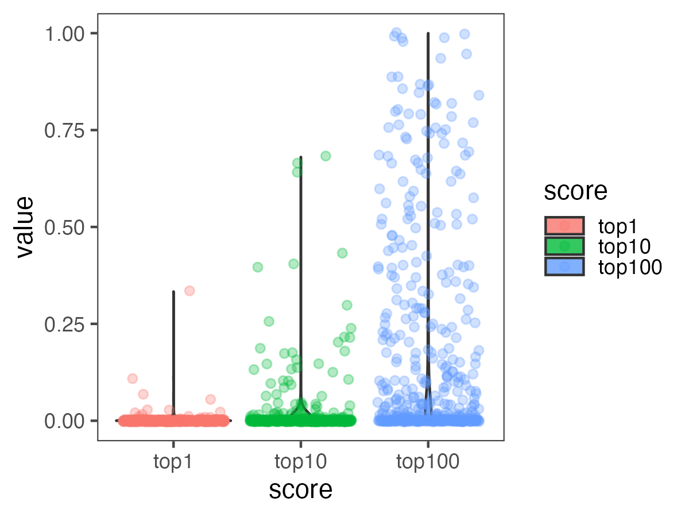

## Aaron's data

I compared the predictions within 256 m cells of the statewide NY Deepbiosphere prediction to Aaron's species list collected at 144 sites using the modified Whitaker species richness sampling method. **These may not be the most relevant comparisons because I think Deepbiosphere is making its prediction for the centroid of the 256 m cell, while Aaron's plots may fall anywhere within the cell and could represent a different habitat. I need to re-run these predictions for the exact location of each of Aaron's sites.**

### Estimated species richness

#### Comparison of estimated species richness by habitat group

### Accuracy metrics

Comparing Deepbiosphere predictions against Aaron's detected presences as 'truth.' These metrics are calculated across only the species detected in both Aaron's and Deepbiopshere's species lists (452 species).

#### Precision and recall

#### Top 1, 10, and 100 scores

The proportion of times across the 144 sites that a predicted species was in the top 1, 10, or 100 most probable classes estimated by DeepBiosphere.

