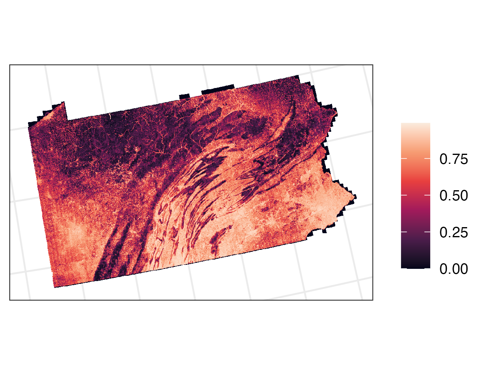
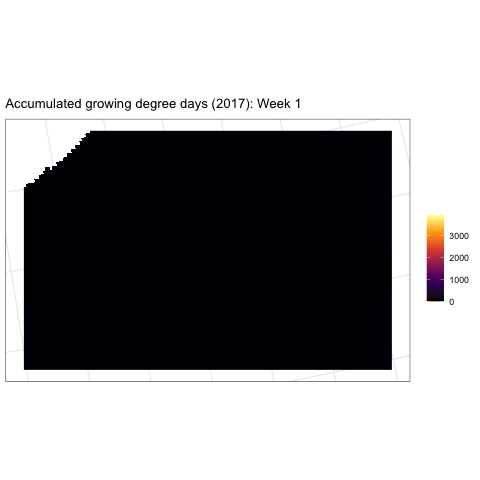
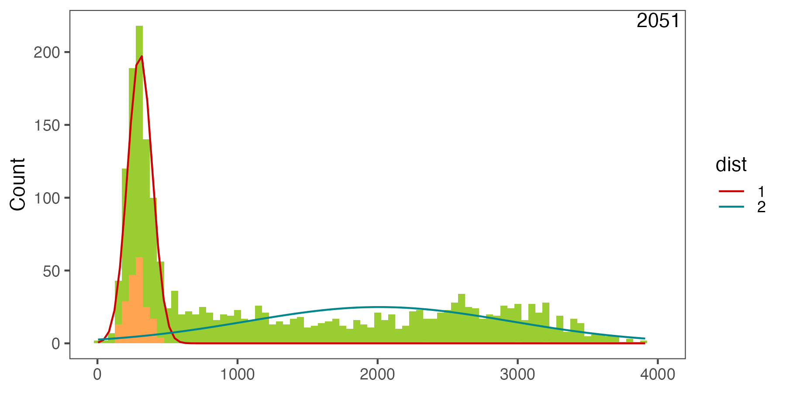
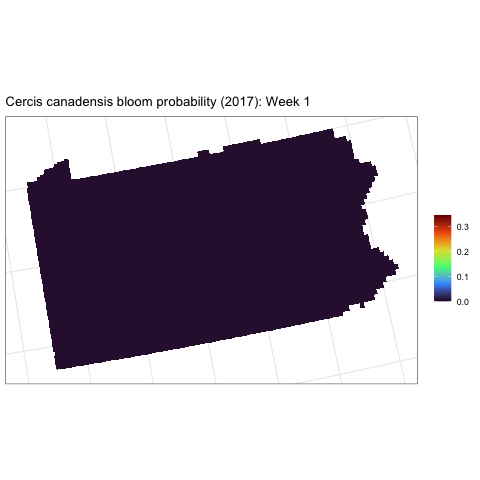

## Background

A majority of crops and flowering plants rely on pollinators like bees, but bee populations are declining globally from habitat loss, pesticide exposure, and land cover change. Understanding habitat and floral resource availability is of critically important for addressing these declines, and requires models of fine-scale floral dynamics across bee foraging landscapes and over growing seasons. However, comprehensive information is not available at the spatial and temporal resolutions relevant to bees, creating a gap that impedes understanding and conservation management.

## Methods

### Spatial predictions

Using [Deepbiosphere](https://doi.org/10.1073/pnas.2318296121) (Gillespie et al. 2024), we are modeling the joint distributions of bee floral resource plant species across Pennsylvania and New York, based on over 600,000 citizen science observations from iNaturalist, spanning 2012 to 2022. We use 1 m resolution NAIP aerial imagery from 2017 and 19 bioclimatic variables (BIOCLIM) to predict the spatial distributions of 100 bee floral resource species and over 2,000 other co-occurring plant species.

### Temporal predictions

To estimate bloom times, we are modeling the curves of seasonal peaks in citizen science observations (from iNaturalist) corresponding to flowering for the entire northeastern US, accounting for geographic variations in climate using thermal time (growing degree days).

We are applying a finite mixture modeling approach to approximate the distribution of bloom observations over growing degree day. Because we are using mostly unsorted citizen science data, all kinds of reproductive life stages are included in addition to blooming. By assuming that the overall distribution of iNaturalist reports for a species represents a mixture of multiple normal distributions, we can single out a curve that best fits the species' bloom phenology.

### Combined spatial and temporal predictions

We can then combine the Deepbiosphere spatial distribution model with the finite mixture model-derived bloom curve over thermal time to estimate blooms over space and time.

## Preliminary results

Below are links to details about the preliminary results.

**Applying Deepbiosphere**

[Uniform train/test split cross-validation accuracy](1.1_accuracy_unif.qmd)

[Individual species accuracy (bee floral resources)](1.1.1_sp_list.qmd)

[Spatial cross-validation accuracy](1.2_accuracy_spatcv.qmd)

**Modeling bloom phenology**

[Floral resource species list](2.0_Phenology_sp_list.qmd)

[Phenology curves of floral resource species](2.1_examine_phenology.qmd)

[Phenology curves of floral resource species (thinned)](2.2_examine_phenology_thin.qmd)

**Applying Deepflora workflow**

[Example: *Cercis canadensis*](3_curvemaps.qmd)

## References

Gillespie LE, Ruffley M, Exposito-Alonso M (2024) Deep learning models map rapid plant species changes from citizen science and remote sensing data. *Proceedings of the National Academy of Sciences* 121:e2318296121. https://doi.org/10.1073/pnas.2318296121
