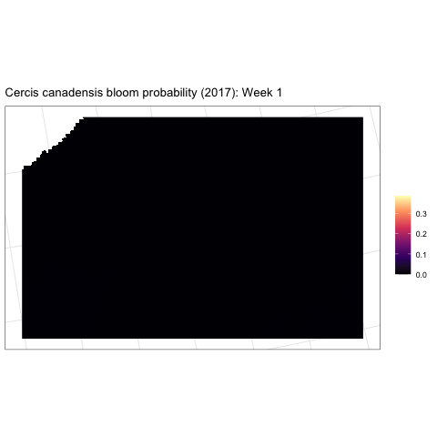

## Background

A majority of crops and flowering plants rely on pollinators like bees, yet bee populations are declining globally from habitat loss, pesticide exposure, and land cover change in their landscapes. Understanding habitat and floral resource availability for bees is of critical importance for addressing these declines and requires models of fine-scale floral dynamics across foraging landscapes and over growing seasons. However, this information is not currently available at spatial and temporal resolutions relevant to bees, creating a gap that impedes both our ecological understanding and conservation management.

## Methods

### Spatial predictions

Using the Deepbiosphere model (Gillespie et al. 2024), we are modeling the joint distributions of bee floral resource plant species across Pennsylvania and New York, based on over 600,000 citizen science observations from iNaturalist, spanning 2012 to 2022. We use 1 m resolution NAIP aerial imagery from 2017 and 19 bioclimatic variables (BIOCLIM) to predict the spatial distributions of 100 bee floral resource species and over 2,000 other co-occurring plant species.

### Temporal predictions

To estimate bloom times from the data, we are modeling the curves of seasonal peaks in citizen science observations (iNaturalist) corresponding to flowering for the entire northeastern US, accounting for geographic variations in climate using thermal time (growing degree days). To do this, we are using a finite mixture modeling approach. This assumes the overall distribution of iNaturalist reports represents a mixture of normal distributions, of which observations of flowers blooming is one.

### Combined spatial and temporal predictions

We can combine the Deepbiosphere spatial distribution model with the finite mixture model distribution over thermal time to estimate bloom over space and time.

## Preliminary results

Below are links to details about the preliminary results.

**Applying Deepbiosphere**

[Uniform train/test split cross-validation accuracy](1.1_accuracy_unif.qmd)

[Individual species accuracy (bee floral resources)](1.1.1_sp_list.qmd)

[Spatial cross-validation accuracy](1.2_accuracy_spatcv.qmd)

**Modeling bloom phenology**

[Floral resource species list](2.0_Phenology_sp_list.qmd)

[Phenology curves of floral resource species](2.1_examine_phenology.qmd)

[Phenology curves of floral resource species (thinned)](2.2_examine_phenology_thin.qmd)

**Applying Deepflora workflow**

[Example: _Cercis canadensis_](3_curvemaps.qmd)

## References

Gillespie LE, Ruffley M, Exposito-Alonso M (2024) Deep learning models map rapid plant species changes from citizen science and remote sensing data. _Proceedings of the National Academy of Sciences_ 121:e2318296121. https://doi.org/10.1073/pnas.2318296121

